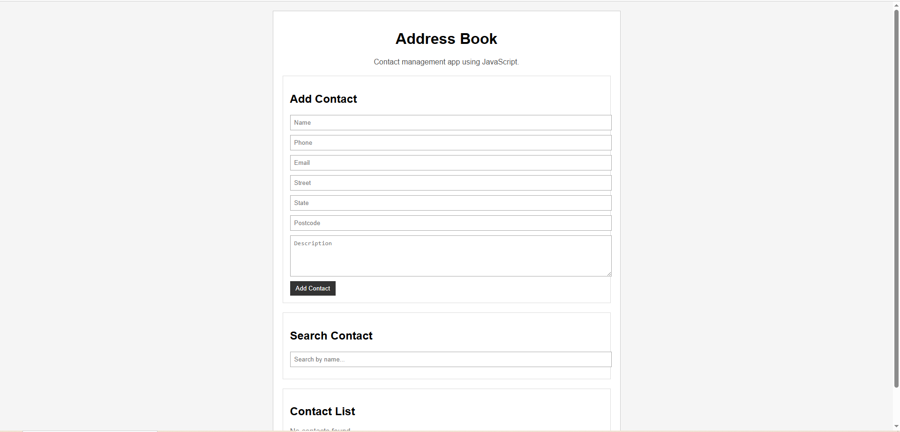

# Address Book App

A simple address book application where users can add, view, search, and delete contacts.

The contacts are stored temporarily in a JavaScript array, so the data will reset when the page is refreshed.

## Features

* Add a new contact
* View all contacts
* Search contacts by name
* Delete a contact by ID

## Contact Details

Each contact includes:

* ID
* Name
* Phone
* Email
* Address

  * Street
  * State
  * Postcode
* Description

## How to Run

1. Download or clone this repository.
2. Open the project folder.
3. Open `index.html` in a browser.

## Screenshot

## Demo Video

[Watch the demo video](./demo.mp4)
